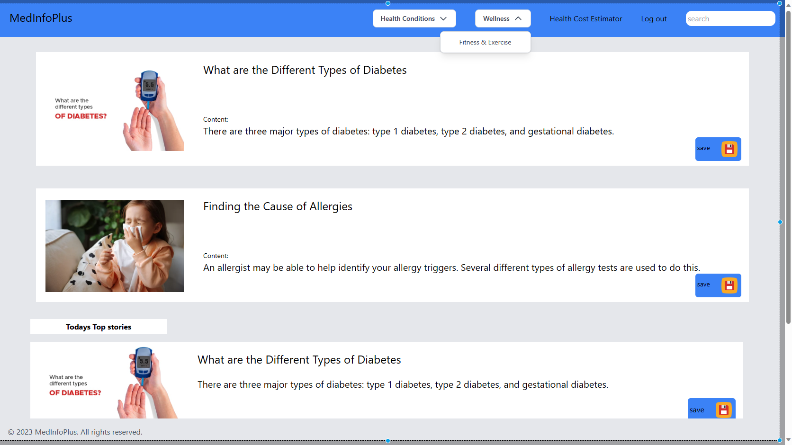
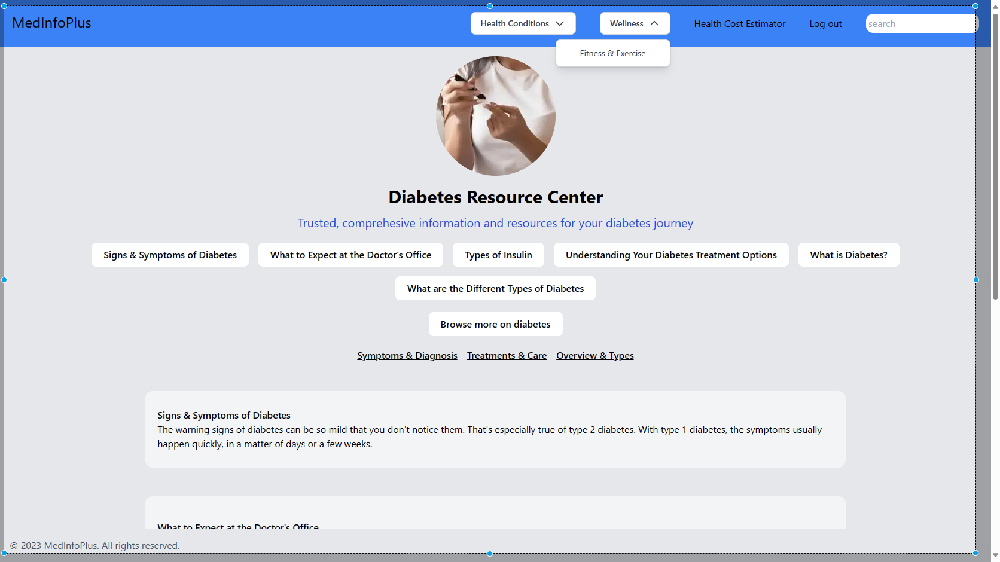

# MEDINFOPLUS


## Table of Contents

- [Introduction](#introduction)
- [Features](#features)
- [Screenshots](#screenshots)
- [Getting Started](#getting-started)
- [Contributors](#contributors)
- [License](#license)

## Introduction

Welcome to **MEDINFOPLUS**, your comprehensive medical information platform. This website is designed to provide users with accurate and up-to-date medical information, making it easier for everyone to understand their health-related questions. MEDINFOPLUS is built using React TypeScript for the front end and Flask for the back end.

Are you looking for reliable medical information? Want to stay informed about the latest health news? Or maybe you need to find a healthcare provider in your area? MEDINFOPLUS has got you covered.

## Features

- **Search Medical Information**: Find answers to your medical questions by searching through a vast database of articles, FAQs, and expert opinions.

- **Latest Health News**: Stay up-to-date with the latest health and medical news from trusted sources.

- **Healthcare Provider Directory**: Easily locate healthcare providers in your area with our comprehensive directory.

- **User-Friendly Interface**: The user interface is designed with simplicity in mind, making it easy for anyone to navigate and find the information they need.

- **Responsive Design**: Whether you're using a desktop, tablet, or mobile device, MEDINFOPLUS adapts to your screen size for a seamless experience.

## Screenshots

Here are some screenshots of the MEDINFOPLUS website:

**Homepage**


<!-- **Search Results**
 -->

**Article Page**


<!-- **Healthcare Provider Directory**
 -->

## Getting Started

To get started with MEDINFOPLUS, follow these steps:

1. Clone the repository:

   ```
   git clone https://github.com/Michael-Gichamu/medinfoplus.git
   ```

2. Install the necessary dependencies for both the front end (React TypeScript) and the back end (Flask).

3. Start the front end and back end servers.

4. Access the website in your browser.

That's it! You're ready to explore and use MEDINFOPLUS.

## Contributors

This project was made possible by the hard work and dedication of our talented authors:

- **Amos Wachira**

  - GitHub: [github.com/amo15310](https://github.com/AMO15310)

- **Michael Gichamu**
  - GitHub: [github.com/michael-gichamu](https://github.com/Michael-Gichamu)

We would like to express our gratitude to everyone who contributed to this project, whether through code, design, or testing.

## License

This project is licensed under the MIT License - see the [LICENSE](LICENSE) file for details.

---

Thank you for choosing MEDINFOPLUS. We hope this platform helps you find the medical information you need and stay informed about your health. If you have any questions, feedback, or suggestions, please don't hesitate to [contact us](mailto:wachiraamos402@gmail.com).
